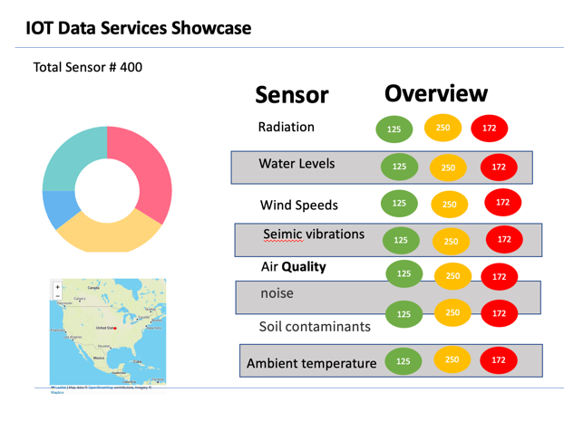

# iot-sensor-events-showcase

This is a demo application that showcases an IoT use case with [RabbitMQ](https://www.rabbitmq.com/), 
[Spring](https://spring.io/), [GemFire](https://tanzu.vmware.com/gemfire) and [Postgres](https://tanzu.vmware.com/postgres).




This code has been used in the following presentations

- [Spring Cloud Data Flow for IoT/Edge Computing with RabbitMQ](https://www.carahsoft.com/learn/event/39136-enable-public-sector-digital-transformations-with-rabbitmq)


The following are the applications

| Appplication                                                                                                                                             | Notes                                                                                                                                                                                                                                                                                                   |
|----------------------------------------------------------------------------------------------------------------------------------------------------------|---------------------------------------------------------------------------------------------------------------------------------------------------------------------------------------------------------------------------------------------------------------------------------------------------------|
| [generator-mqtt-source](https://github.com/ggreen/iot-sensor-events-showcase/tree/main/applications/generator-mqtt-source)                               | Generate Edge Iot sensor dat                                                                                                                                                                                                                                                                            |
| [iot-event-dashboard](https://github.com/ggreen/iot-sensor-events-showcase/tree/main/applications/iot-event-dashboard)                                   | Spring Reactive web application to visualize device information                                                                                                                                                                                                                                         |
| [jdbc-batch-upsert-rabbit-stream-sink](https://github.com/ggreen/iot-sensor-events-showcase/tree/main/applications/jdbc-batch-upsert-rabbit-stream-sink) | Data pipeline application to insert sensor data into an JDBC compatiable database                                                                                                                                                                                                                       |
| [rabbit-stream-gemfire-cq-processor](https://github.com/ggreen/iot-sensor-events-showcase/tree/main/applications/rabbit-stream-gemfire-cq-processor)     | Data pipeline application to filter JSON data based on a matching GemFire [OQL](https://gemfire.docs.pivotal.io/98/geode/developing/querying_basics/query_basics.html) [continuous queries](https://gemfire.docs.pivotal.io/95/geode/developing/continuous_querying/how_continuous_querying_works.html) |

## Start Postgres

```shell
brew services start postgresql&
```

```shell
psql -d postgres -U postgres
```

## Postgres JSONB SQL Examples 

```sqlite-sql

insert into sensor_record (id,DATA)
values ('1727288810','{"id":"1727288810","status":-688,"priority":16564,"sensor":{"id":"1794806447","name":"Harvey Welch","sensorLocation":{"locationName":"20220706083642885-369569325","latitude":35.746512259918504,"longitude":-94.39453125000001}}}');
```

Insert Normal Priority

```sqlite-sql
insert into sensor_record (id,DATA)
values ('1','{"id":"1","status":1,"priority":0,"sensor":{"id":"1","name":"Water Level","sensorLocation":{"locationName":"DC","latitude":38.873929,"longitude":-76.981201}}}');
```

Insert Warning Priority
```sqlite-sql
insert into sensor_record (id,DATA)
values ('2','{"id":"2","status":1,"priority":1,"sensor":{"id":"2","name":"Air Quality","sensorLocation":{"locationName":"LA","latitude":33.998027,"longitude":-118.212891}}}');
```

Counts by Sensor Types
```sqlite-psql

select
  totals_sensor_name.label label,
  (select count(*) from sensor_record where  data#>>'{sensor,name}' = totals_sensor_name.label and data#>>'{priority}' = '0') normal_count,
  (select count(*) from sensor_record where  data#>>'{sensor,name}' = totals_sensor_name.label and data#>>'{priority}' = '1') warning_count,
  (select count(*) from sensor_record where  data#>>'{sensor,name}' = totals_sensor_name.label and cast(data#>>'{priority}' as int) > 2) severe_count
from
    (select count(*) total_count,data#>>'{sensor,name}' label   
    from sensor_record  group by  data#>>'{sensor,name}') totals_sensor_name
order by label;

```

Example query summaries 

```sqlite-psql

select (select count(id) from sensor_record) total_count,
       (select count(id)  from sensor_record where cast(data#>'{priority}' as int) = 0) normal_count,
       (select count(id)  from sensor_record where cast(data#>'{priority}' as int) = 1) warning_count,
       (select count(id)  from sensor_record where cast(data#>'{priority}' as int) > 1) severe_count

```


```sqlite-sql
select data#>'{sensor,sensorLocation,latitude}',  data#>'{sensor,sensorLocation,longitude}'  from sensor_record;
```

Increment Alarms UPDATE

````sqlite-sql
UPDATE sensor_record set data = jsonb_set(data,array['alarmCount'],to_jsonb((select (data->>'alarmCount')::int+1 from sensor_record nested_sq where nested_sq.id = '1'))) where id = '1';
````


Updata Alarm Count to 0

```sqlite-sql
UPDATE sensor_record set data = jsonb_set(data,array['alarmCount'],to_jsonb(0));
```


Update alarm count and priority

```sqlite-sql
UPDATE sensor_record set data = (jsonb_set(data,array['alarmCount'],to_jsonb(3)) || '{"priority": 0}');

```

Upsert


```sqlite-sql
-    INSERT INTO sensor_alerts (sensor_id, sensor_name,alert_cnt) VALUES(:id,:name,1)
      ON CONFLICT ON CONSTRAINT sensor_alerts_pkey
      DO
      UPDATE SET alert_cnt = (select alert_cnt+1 from sensor_alerts nested_sq where nested_sq.sensor_id = :id);
    - UPDATE sensor_record set data = jsonb_set(data,array['priority'],(SELECT CASE
      WHEN (select alert_cnt from sensor_alerts where sensor_id = :id)  < 10 THEN '0'
      WHEN (select alert_cnt from sensor_alerts where sensor_id = :id)  < 20 THEN '1'
      ELSE '2'
      END AS PRIORITY_ID)::jsonb) where id = :id;
```